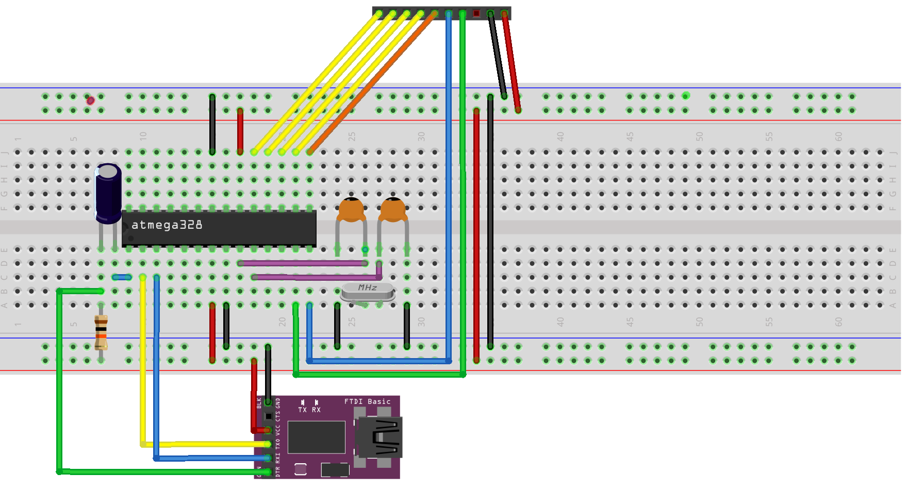

# Modular microcontroller programmer

The purpose of this repository is to document how to build a circuit which allow us to program different standalone microcontrollers using Arduino IDE.

To do this we will build a common base, which will form the programmer, to which we will connect small dedicated circuits adapted to each type of microcontroller that we want to program in a modular way.

## Motivation

When we talk about programming any microcontroller using the Arduino IDE we usually think of a board connected to the microcontroller enabling serial programming. However, the size of the board and the layout of the wires can be a bit annoying every time we have to place the microcontroller in the circuit to program it.

In addition, if we want to interleave the programming of different types of microcontroller we are forced to make tedious modifications to the circuit every time we want to change.

That is why in this document I intend to explain how to manufacture a compact and modular programmer, which allows us to program the desired microcontrollers in an agile way, making as few connections as possible.

## Requirements

We can achieve the goal of this project with different types of AVR microcontrollers and Arduino boards, but in order to facilitate the understanding of the guide, we will focus on the use case of wanting to program an `ATtiny85` using an `ATmega328`.

- **Arduino Board** (we will use an `Arduino UNO`)
- **ATmega328 microcontroller** (we will use `ATmega328P-U`)
- **10K resistor**
- 2x**22pF ceramic capacitors**
- **16Mhz Crystal**
- **100nF capacitor**
- **USB to TTL converter with DTR pin**
- **8Mhz Crystal**
- 3x**220Ω resistors**
- 3x**3mm color LEDs**
- **9 or more pins female connector**
- **9 or more pins male connector**

## **[Step 1]** Burn the ATmega328 bootloader

First of all, we need to burn into the microcontroller a bootloader that allows us to upload the code for later use it as an in-system programmer (ISP).

### **[Step 1.1]** Make the conections

To do this, we make use of the Arduino board and the following connections:
- **10K resistor**
- 2x**22pF ceramic capacitors**
- **16Mhz Crystal**

### **[Step 1.2]** Flash the Arduino board

We need to flash the Arduino board to be able to program other microcontrollers. Go to `File->Examples->ArduinoISP` and upload that code to the board.

### **[Step 1.3]** Install hardware package for ATmega devices

To make the IDE recognize the ATmega328 you need to install the [MiniCore](https://github.com/MCUdude/MiniCore) hardware package. Copy [this URL](https://mcudude.github.io/MiniCore/package_MCUdude_MiniCore_index.json) and paste it in `File->Preferences->Additional Boards Manager URLs`. 

After that, go to `Tools->Board->Boards Manager`, type `minicore`, and install the package.

### **[Step 1.4]** Burn the bootloader

Select the `ATmega328` as board, `External 16MHz` as clock, and `Arduino as ISP (MiniCore)` as programmer. After that, you can click on `Burn Bootloader`.

This is the step that can give more problems depending on the state of the microcontroller at the time of burning the bootloader and other factors. If it fails you can try the following:
- Ensure the quality of the connections.
- Replace the quartz crystal with a compatible one and set the external clock in the IDE.
- Use the internal 8MHz clock.
- Hard reset the microcontroller.

## **[Step 2]** Flash ATmega328 as ISP programmer

In the same way that we have used an Arduino board to program the ATmega328, we will use it to program other microcontrollers. That is why we need to flash the ArduinoISP code to it just like we did on the board.

### **[Step 2.1]** Make the conections

We can use the Arduino board again to flash the microcontroller but at this point, we can continue without it. To do this, we will use the USB to TTL interface.

On the above schematic, disconnect the Arduino board and add the following components:
- **100nF capacitor**
- **USB to TTL converter with DTR pin**

## **[Step 3]** Prepare the programmer external conections

Now that the ATmega328 is flashed in ISP programmer mode, add the connections to the dedicated circuit of the microcontroller to be programmed. 

### **[Step 3.1]** Make the conections

To achieve the modular form, we will add the connections to the dedicated circuit using a female connector, as the dedicated circuit will be inserted using a male connector. 

On the previous circuit, we make the following modifications where the yellow wires represent programming connections and the rest are control LEDs (omittable).
- **9 or more pins female connector**

Note that we make the connections according to the Arduino mapping of the microcontroller pins. You can take the following schematic as a reference.

## **[Step 4]** Prepare the dedicated circuit

At this point, we will build the circuit dedicated to the programming of the microcontroller, which will be connected to the one we have prepared in the previous steps.

### **[Step 4.1]** Make the conections

Keeping in mind that this guide is focused on the preparation of a programmer for ATtiny85, we will build the following circuit using the components described here:
- **8Mhz Crystal**
- 3x**220Ω resistors**
- 3x**3mm color LEDs**
- **9 or more pins male connector**

> **_NOTE:_** The quartz crystal will depend on the frequency at which we want the ATinty85 to work, so it should not be soldered but inserted.

## **[Optional]** Now on PCB

**TODO**
